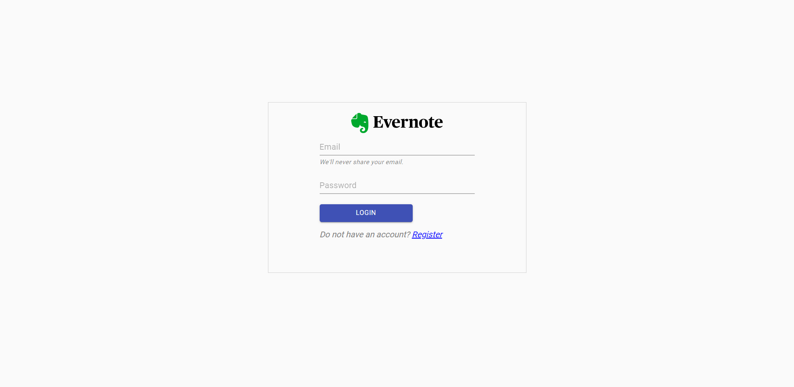
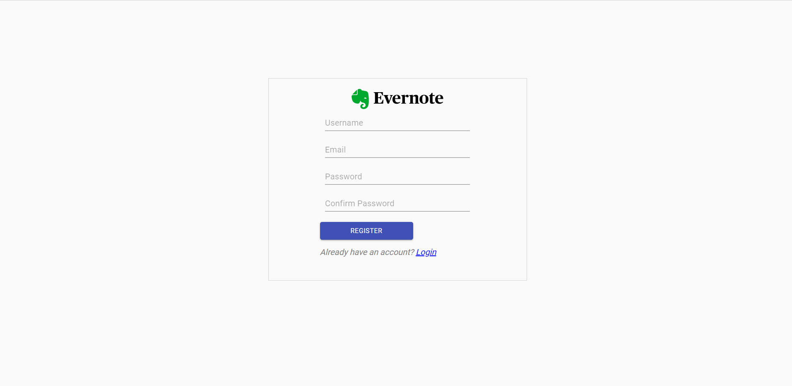
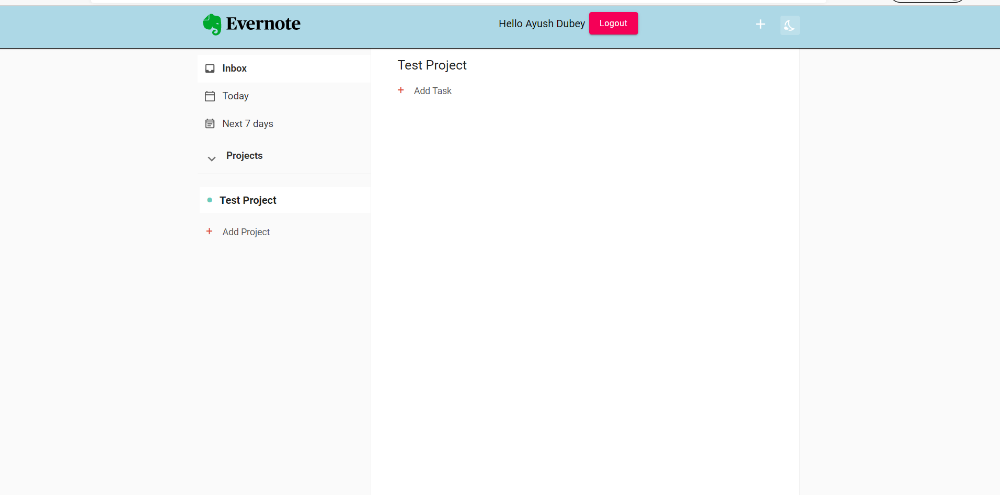
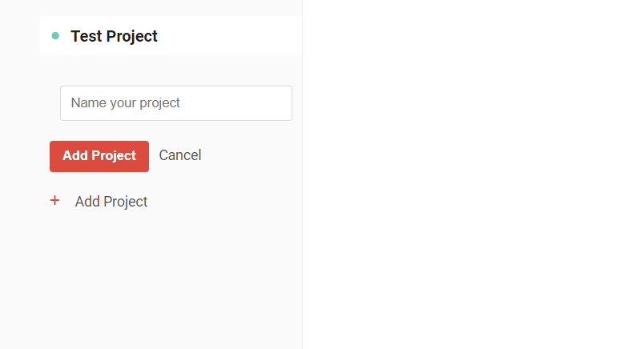
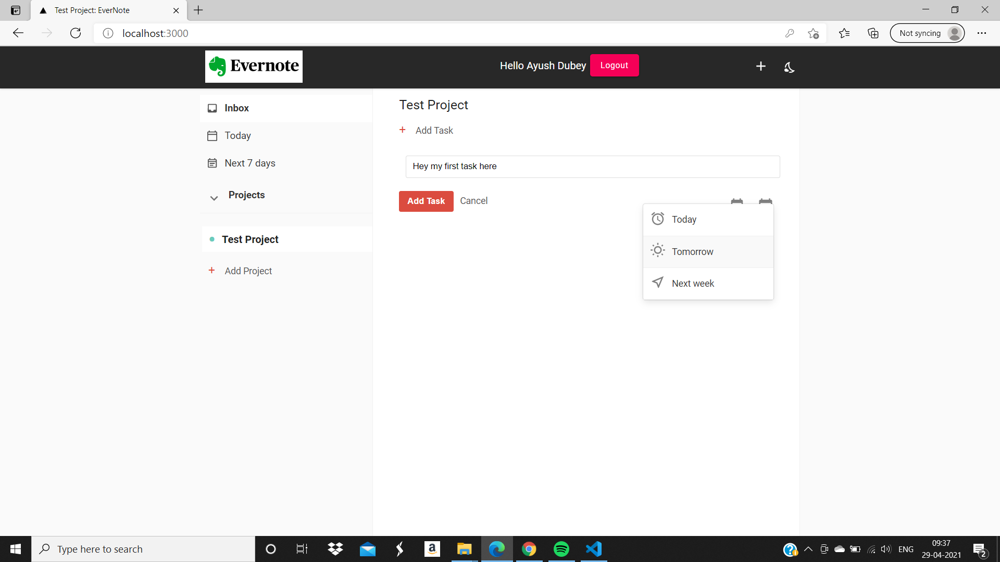

> Evernote clone 2.0 built on ReactJs and firebase database.
### `Packages to be installed :`
    npm install

    "@material-ui/core": "^4.11.3"
    "@material-ui/icons": "^4.11.2"
    "firebase": "^8.3.2"
    "moment": "^2.29.1"
    "node-sass": "^5.0.0"
    "prop-types": "^15.7.2"
    "react": "^17.0.2"
    "react-dom": "^17.0.2"
    "react-router-dom": "^5.2.0"

## Code Output:

> ### `User Login Page`:

> ### `User Register Page`:

> ### `Home Page`:

